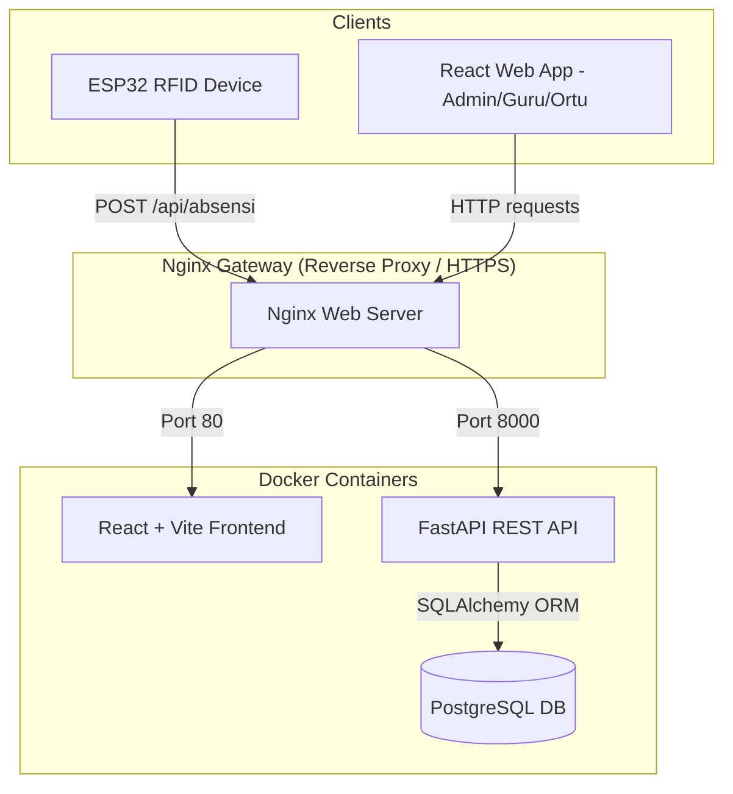

# System Architecture Overview

System design and architecture of the Sempoa SIP TC Pariaman application.

---

## 1. High-Level Architecture Diagram

---

## 2. Component Design & Responsibility Matrix

### A. Hardware Client (ESP32 RFID Reader)
- **Role**: Reads user's RFID key card taps.
- **Protocol**: HTTP/HTTPS POST to `/api/absensi`.
- **Payload**: Form-urlencoded fields containing `uid`, `waktu` (timestamp), and `mode` (ONLINE/OFFLINE).
- **Authentication**: Authenticated via pre-shared HMAC comparison digest inside `X-API-Key` headers.

### B. Gateway (Nginx Proxy)
- **Role**: Entry point for web traffic.
- **Responsibility**: SSL termination, routing HTTP traffic to frontend assets or proxying request payloads to backend API microservices.

### C. Backend API Service (FastAPI)
- **Role**: Orchestrates business rules, JWT session validations, and attendance operations.
- **State Store**: PostgreSQL database.

### D. Frontend Portal (React Web App)
- **Role**: Dashboard user interface.
- **State Store**: React Context for JWT auth cache + TanStack Query for cache invalidations.
